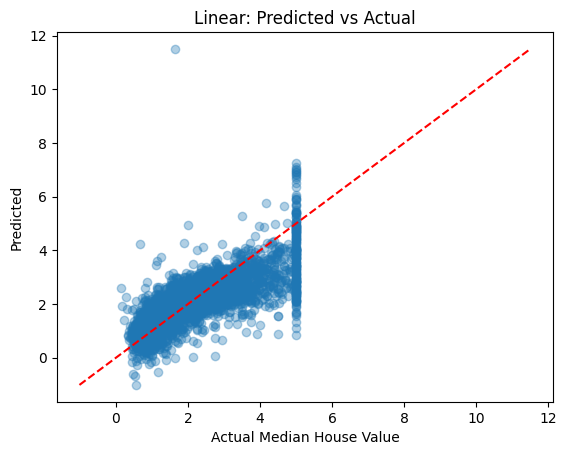
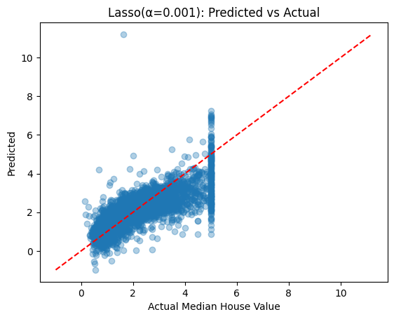
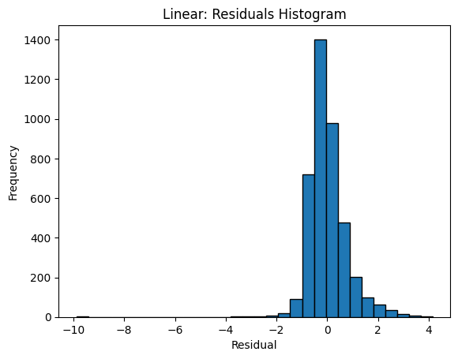
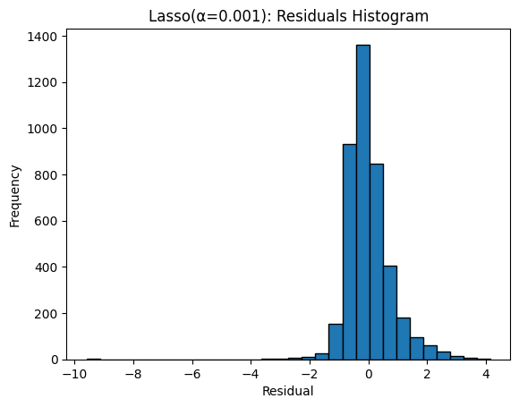
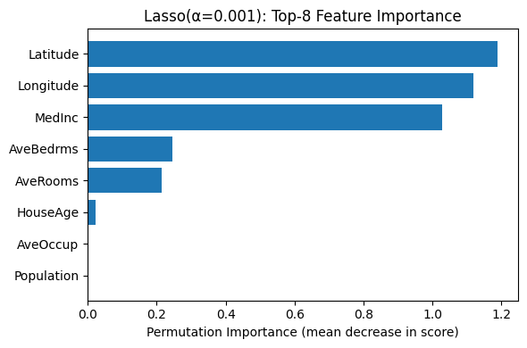
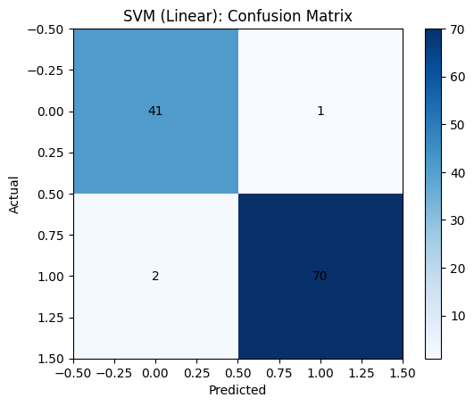
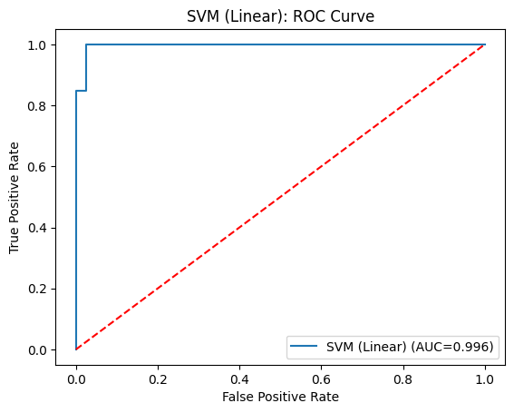
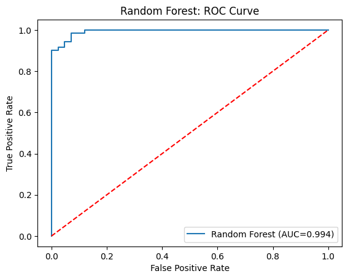
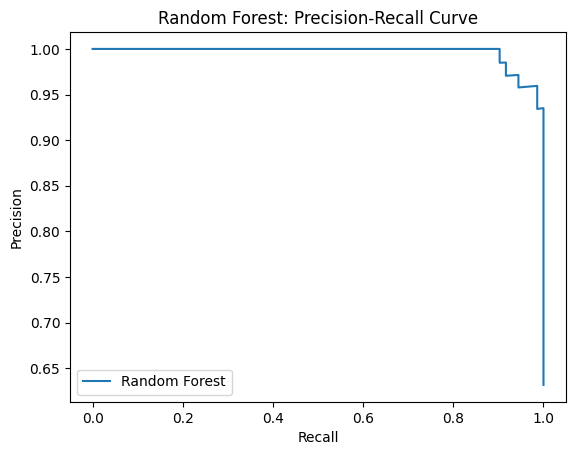

# Math 5750/6880 – Project 1

This repository contains my work for **Project 1** of *Mathematics of Data Science (Math 5750/6880)*.  
The project consists of three main components:  

1. **Project Euler Problem** (Python)  
2. **Regression Analysis** (California Housing dataset)  
3. **Classification Analysis** (Breast Cancer Wisconsin dataset)  

All code is in `Project1.ipynb`.  
The final report was written in LaTeX (PDF submitted on Gradescope).  

---

## Part 3: Project Euler Problem

**Problem 2 – Even Fibonacci numbers**  
- **Task**: Find the sum of all even-valued Fibonacci numbers less than or equal to 4,000,000.  
- **Approach**: Instead of generating the entire Fibonacci sequence, I used the recurrence relation for even Fibonacci terms:  
  \[
  E_{k+1} = 4E_k + E_{k-1}, \quad E_0 = 2, \; E_1 = 8
  \]  
  This allows efficient computation by skipping odd terms.  

- **Result**:  
Sum of even Fibonacci numbers ≤ 4,000,000 = 4,613,732

---

## Part 4: Regression Analysis – California Housing

**Dataset**  
- 20,640 samples, 8 numerical features.  
- Features: `MedInc, HouseAge, AveRooms, AveBedrms, Population, AveOccup, Latitude, Longitude`.  
- Train/Test split: 16,512 / 4,128 samples.  

**Model Performance**

| Model             | R²     | MAE    | RMSE   |
|-------------------|--------|--------|--------|
| Linear Regression | 0.5758 | 0.5332 | 0.7456 |
| Ridge (α=0.7)     | 0.5758 | 0.5332 | 0.7456 |
| Lasso (α=0.001)   | 0.5769 | 0.5331 | 0.7446 |

**Coefficient Analysis**  
- **Linear**: AveBedrms (+0.7831), MedInc (+0.4487), Longitude (−0.4337), Latitude (−0.4198)  
- **Ridge**: Latitude (−0.8964), Longitude (−0.8693), MedInc (+0.8543)  
- **Lasso**: Latitude (−0.8858), Longitude (−0.8581), MedInc (+0.8491)  

**Best Model**: Lasso (α=0.001)  

**Figures**

- Predicted vs Actual  
-   
-   
-   

- Residuals Histogram  
-   
-   
-   

- Feature Importance (Permutation, Lasso)  
-   

---

## Part 5: Classification Analysis – Breast Cancer Dataset

**Dataset**  
- 569 samples, 30 numerical features.  
- Train/Test split: 455 / 114 samples.  

**Model Performance**

| Model          | Accuracy | ROC-AUC | Avg Precision |
|----------------|----------|---------|---------------|
| SVM (Linear)   | 0.9737   | 0.9964  | 0.9977        |
| Random Forest  | 0.9474   | 0.9937  | 0.9964        |

**Top Features**  
- **SVM (|coef| top 10)**: worst texture, worst smoothness, area error, mean compactness, worst area, radius error, worst concavity, worst perimeter, perimeter error, worst radius  
- **Random Forest (top 10 importances)**: worst perimeter, worst area, worst concave points, mean concave points, worst radius, mean radius, mean perimeter, mean concavity, mean area, worst concavity  

**Figures**

- SVM  
-   
-   
-   

- Random Forest  
-   
-   
-   

---

